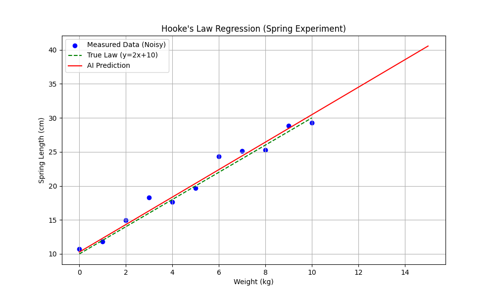
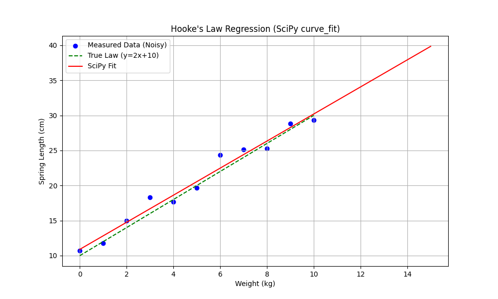

# Week 2: 머신러닝 기초 (Machine Learning Basics)

## 📚 학습 목표

이번 주차에서는 머신러닝의 핵심 개념들을 이론과 실습을 통해 학습합니다.

**배울 내용:**
1. 머신러닝의 세 가지 유형 (지도/비지도/강화 학습)
2. 데이터 전처리와 정규화
3. 손실 함수와 최적화
4. 선형 회귀 (Linear Regression)
5. SciPy를 이용한 수치해석적 접근

**왜 중요한가?**
- 머신러닝의 기초 개념은 모든 AI 기술의 출발점
- 데이터를 올바르게 준비하는 것이 성능의 80%를 결정
- 최적화는 AI가 학습하는 핵심 메커니즘

---

## 🎯 들어가기: 머신러닝이란?

**정의:**
머신러닝은 컴퓨터가 명시적으로 프로그래밍하지 않아도 데이터로부터 패턴을 학습하는 기술입니다.

**전통적 프로그래밍 vs 머신러닝:**
```
[전통적 방식]
규칙 + 데이터 → 결과
예: IF 키워드 == "할인" THEN 스팸

[머신러닝]
데이터 + 결과 → 규칙 (AI가 스스로 찾음)
예: 수천 개의 이메일 → AI가 스팸 패턴 학습
```

---

## 1. 머신러닝의 세 가지 학습 방법

### 1) 지도 학습 (Supervised Learning) - "선생님이 있는 공부"

**개념:**
입력(X)과 정답(Y)을 함께 주고, AI가 X→Y 관계를 학습합니다.

**비유:**
수학 문제집을 풀 때 해설지를 보면서 정답을 맞추는 과정

**실생활 예시:**
- 스팸 메일 분류: (이메일 내용) → (스팸/정상)
- 집 가격 예측: (평수, 위치, 방 개수) → (가격)
- 용수철 길이 예측: (무게) → (길이) ← **오늘 실습!**

---

### 2) 비지도 학습 (Unsupervised Learning) - "선생님 없는 자습"

**개념:**
정답(라벨) 없이 데이터만 주고, AI가 스스로 패턴을 찾습니다.

**비유:**
비슷한 성격의 친구들끼리 자동으로 모둠 만들기

**실생활 예시:**
- 고객 세분화: 구매 패턴이 비슷한 고객끼리 그룹화
- 뉴스 자동 분류: 비슷한 주제의 기사끼리 묶기

---

## 🔬 Lab 1: 비지도 학습 - 군집화 (02_unsupervised_clustering.py)

### 목적
K-Means 알고리즘을 사용하여 정답 없이 데이터를 자동으로 그룹화합니다.

### 프로그램 실행
```bash
cd week2
uv run 02_unsupervised_clustering.py
```

### 1. K-Means 알고리즘이란?

**기본 아이디어:**
데이터를 K개의 그룹으로 나누되, 같은 그룹 내 데이터는 최대한 가깝게!

**작동 방식:**
```
1. 랜덤하게 K개의 중심점 찍기
2. 각 데이터를 가장 가까운 중심점에 배정
3. 각 그룹의 평균 위치로 중심점 이동
4. 2-3을 중심점이 안 움직일 때까지 반복
```

### 2. 코드 핵심 부분

**데이터 생성:**
```python
# 3개의 그룹을 만들지만, AI에게는 알려주지 않음!
group1 = np.random.normal(loc=[2, 2], scale=0.5, size=(30, 2))
group2 = np.random.normal(loc=[8, 3], scale=0.5, size=(30, 2))
group3 = np.random.normal(loc=[5, 8], scale=0.5, size=(30, 2))
X = np.vstack([group1, group2, group3])  # 합치기
```

**거리 계산 (유클리드 거리):**
```python
# 각 점에서 모든 중심점까지의 거리
distances = np.sqrt(((X - centers[:, np.newaxis])**2).sum(axis=2))
# 가장 가까운 중심점 찾기
closest_cluster = np.argmin(distances, axis=0)
```

**중심점 업데이트:**
```python
# 각 그룹의 평균 위치 = 새로운 중심점
new_centers = np.array([X[closest_cluster == j].mean(axis=0) for j in range(k)])
```

### 3. 결과 해석


**관찰해야 할 것:**
- **색깔**: AI가 스스로 분류한 그룹 (빨강, 초록, 파랑)
- **검은 별**: 각 그룹의 중심점 (Centroid)
- **분포**: 같은 색 점들이 서로 가까이 있음

**핵심 개념:**
- AI는 "정답"을 몰랐지만, 패턴을 스스로 찾았음!
- 우리가 만든 3개 그룹과 거의 일치
- 이것이 비지도 학습의 힘!

---

### 3) 강화 학습 (Reinforcement Learning) - "당근과 채찍"

**개념:**
행동에 대한 보상/처벌을 통해 최적의 전략을 학습

**비유:**
강아지 훈련 - 잘하면 간식, 못하면 무시

**실생활 예시:**
- 알파고: 이기면 +1점, 지면 -1점
- 자율주행: 안전운전 +10점, 사고 -1000점

---

## 2. 데이터 전처리 (Data Preprocessing)

### 왜 필요한가?

**문제 상황:**
```
데이터1: 연봉 = 50,000,000원
데이터2: 나이 = 30세
```
→ 숫자 크기가 너무 다름! AI가 "연봉이 중요한가보다"라고 착각

**해결책:**
모든 데이터를 같은 범위(보통 0~1)로 맞추기 = **정규화**

---

## 🔬 Lab 2: 데이터 전처리 (03_data_preprocessing.py)

### 목적
Min-Max Normalization을 통해 서로 다른 스케일의 데이터를 0~1 범위로 변환합니다.

### 프로그램 실행
```bash
cd week2
uv run 03_data_preprocessing.py
```

### 1. Min-Max Normalization

**수식:**
```
x_normalized = (x - x_min) / (x_max - x_min)
```

**예시:**
```
연봉: 30,000,000 ~ 100,000,000원
최소값인 30,000,000원 → 0
최대값인 100,000,000원 → 1
중간값인 65,000,000원 → 0.5
```

### 2. 코드 핵심 부분

**원본 데이터:**
```python
salary = np.random.uniform(30000000, 100000000, 50)  # 3천만~1억
age = np.random.uniform(20, 60, 50)  # 20~60세
```

**정규화:**
```python
salary_normalized = (salary - salary.min()) / (salary.max() - salary.min())
age_normalized = (age - age.min()) / (age.max() - age.min())
```

### 3. 결과 해석


**왼쪽 그래프 (Before):**
- X축(나이): 20~60
- Y축(연봉): 30,000,000~100,000,000
- 문제: 연봉이 너무 커서 그래프가 세로로 길쭉함

**오른쪽 그래프 (After):**
- X축: 0~1
- Y축: 0~1
- 해결: 데이터가 정사각형 안에 고르게 분포!

**핵심 개념:**
- 정규화 후 모든 특성이 동등하게 취급됨
- AI 학습이 훨씬 안정적이고 빠름
- 필수적인 전처리 단계!

---

## 3. 손실 함수와 최적화

### 손실 함수 (Loss Function)

**정의:**
AI가 얼마나 틀렸는지 측정하는 점수

**비유:**
시험 점수 (0점 = 완벽, 100점 = 엉망)

**종류:**
- **MSE (Mean Squared Error)**: (예측 - 실제)²의 평균
  - 많이 틀릴수록 벌점이 제곱으로 커짐
  - 회귀 문제에 주로 사용

### 최적화 (Optimization)

**정의:**
손실 함수를 최소화하는 과정

**비유:**
눈을 가리고 산에서 가장 낮은 곳 찾기

---

## 🔬 Lab 3: 경사 하강법 (04_gradient_descent_vis.py)

### 목적
Gradient Descent 알고리즘이 어떻게 최소값을 찾는지 시각화합니다.

### 프로그램 실행
```bash
cd week2
uv run 04_gradient_descent_vis.py
```

### 1. 경사 하강법 (Gradient Descent)

**기본 아이디어:**
```
1. 현재 위치에서 기울기(경사) 계산
2. 경사가 내려가는 방향으로 한 걸음 이동
3. 1-2를 반복하여 가장 낮은 곳에 도달
```

**수식:**
```
x_new = x_old - learning_rate × gradient
```

**핵심 용어:**
- **Gradient (기울기)**: 어느 방향이 오르막/내리막인지
- **Learning Rate (학습률)**: 한 번에 얼마나 이동할지
  - 너무 크면: 왔다갔다 튕김
  - 너무 작으면: 너무 느림

### 2. 코드 핵심 부분

**손실 함수:**
```python
def loss_function(x):
    return x**2  # 가장 간단한 2차 함수, 최소값은 x=0
```

**기울기 계산:**
```python
def gradient(x):
    return 2*x  # y = x²의 미분
```

**최적화 루프:**
```python
for i in range(20):
    grad = gradient(current_x)  # 기울기 계산
    current_x = current_x - learning_rate * grad  # 이동!
```

### 3. 결과 해석


**그래프 설명:**
- **검은 곡선**: 손실 함수 (산 모양)
- **빨간 점**: 각 단계에서의 위치
- **빨간 점선**: 이동 경로

**관찰:**
- 시작: x = -4 (높은 곳)
- 매 단계마다 0에 가까워짐
- 20단계 후: x ≈ 0 (정답!)

**핵심 개념:**
- Gradient Descent는 AI 학습의 핵심!
- 모든 신경망이 이 원리로 학습
- 복잡한 문제도 같은 방식

---

## 🪐 Lab 4: 선형 회귀 (01_linear_regression_spring.py)

### 목적
TensorFlow를 사용하여 훅의 법칙(Hooke's Law)을 데이터로부터 학습합니다.

### 프로그램 실행
```bash
cd week2
uv run 01_linear_regression_spring.py
```

### 1. 문제 정의

**훅의 법칙:**
```
F = kx
용수철 길이 = (초기 길이) + (용수철 상수) × (무게)
```

**우리의 실험:**
- 초기 길이: 10cm
- 용수철 상수: 2 cm/kg
- 진짜 공식: `길이 = 2 × 무게 + 10`

**도전:**
측정 오차가 있는 데이터로 진짜 공식을 찾아라!

### 2. 선형 회귀 (Linear Regression)

**정의:**
직선 방정식 `y = ax + b`를 데이터에 가장 잘 맞게 찾기

**머신러닝 용어:**
- `a` = Weight (가중치)
- `b` = Bias (편향)
- 학습 목표: 최적의 `a`와 `b` 찾기

### 3. TensorFlow 동작 원리

**1) 데이터 준비:**
```python
weights = [0, 1, 2, 3, 4, 5, 6, 7, 8, 9, 10]  # kg
true_lengths = 2 * weights + 10  # 진짜 공식
# 측정 오차 추가
measured_lengths = true_lengths + noise
```

**2) 모델 구성:**
```python
model = tf.keras.Sequential([
    tf.keras.layers.Dense(units=1, input_shape=[1])
])
```
- `Dense`: 뉴런 1개짜리 가장 간단한 층
- `units=1`: 출력 1개 (길이 예측)
- `input_shape=[1]`: 입력 1개 (무게)

**3) 컴파일:**
```python
model.compile(
    optimizer='sgd',  # Stochastic Gradient Descent
    loss='mean_squared_error'  # MSE 손실 함수
)
```

**4) 학습:**
```python
model.fit(weights, measured_lengths, epochs=500)
```
- **Epoch**: 전체 데이터를 한 번 공부하는 것
- 500 epochs = 500번 반복 학습

### 4. Epoch의 의미

**1 Epoch 동안 일어나는 일:**
```
1. Forward Pass: 현재 파라미터로 예측
2. Loss 계산: 예측과 실제값의 차이
3. Backward Pass: 기울기 계산
4. Update: 파라미터 조정 (Gradient Descent)
```

**왜 500번이나?**
- 1번으로는 부족 (오차가 큼)
- 반복할수록 정확해짐
- 너무 많으면: 시간 낭비, Overfitting

### 5. 결과 해석



**그래프 요소:**
- **파란 점**: 측정 데이터 (노이즈 포함)
- **초록 점선**: 진짜 법칙 (y = 2x + 10)
- **빨간 실선**: AI가 찾은 법칙

**학습된 파라미터:**
```
예측: 길이 = 2.02 × 무게 + 10.28
실제: 길이 = 2.00 × 무게 + 10.00
```
→ 거의 완벽!

**핵심 개념:**
- AI가 노이즈를 무시하고 본질적 패턴을 찾음
- 이것이 머신러닝의 강력함!
- 수학 공식을 몰라도 데이터만 있으면 OK

---

## ⚛️ Lab 5: SciPy를 이용한 수치해석

### 왜 SciPy인가?

**TensorFlow vs SciPy:**
| 항목 | TensorFlow | SciPy |
|------|-----------|-------|
| 접근 방식 | 반복 최적화 | 수학적 해법 |
| 속도 | 느림 (500 epochs) | 빠름 (즉시) |
| 복잡도 | 간단함 | 약간 복잡 |
| 용도 | 신경망, 딥러닝 | 전통적 수치해석 |
| 확장성 | 복잡한 모델 가능 | 간단한 모델만 |

**언제 뭘 쓸까?**
- 간단한 회귀: SciPy가 더 빠름
- 복잡한 신경망: TensorFlow 필수

---

### Lab 5-1: SciPy 선형 회귀 (ex/01_spring_scipy.py)

### 목적
`scipy.optimize.curve_fit`으로 직접적으로 최적 파라미터를 계산합니다.

### 프로그램 실행
```bash
cd week2/ex
uv run 01_spring_scipy.py
```

### 1. curve_fit이란?

**동작 원리:**
- 선형 대수학 사용
- 최소자승법 (Least Squares)
- 한 번에 최적해 계산!

**장점:**
- 매우 빠름
- Epoch 개념 없음
- 수학적으로 정확

### 2. 코드 핵심 부분

**모델 함수 정의:**
```python
def linear_func(x, a, b):
    return a * x + b
```

**최적화:**
```python
popt, pcov = curve_fit(linear_func, weights, measured_lengths)
learned_a, learned_b = popt  # 최적 파라미터
```

**popt vs pcov:**
- `popt`: 최적 파라미터 (Optimal Parameters)
- `pcov`: 공분산 행렬 (불확실성 정보)

### 3. 결과



```
예측: 길이 = 1.93 × 무게 + 10.90
```

**TensorFlow와 비교:**
- 결과 거의 동일
- 속도는 SciPy가 훨씬 빠름
- 하지만 TensorFlow가 더 확장 가능

---

### Lab 5-2: SciPy 최적화 (ex/04_optimization_scipy.py)

### 목적
`scipy.optimize.minimize`로 함수의 최소값을 찾습니다.

### 프로그램 실행
```bash
cd week2/ex
uv run 04_optimization_scipy.py
```

### 1. minimize 함수

**사용법:**
```python
result = minimize(
    objective_func,  # 최소화할 함수
    x0=-3.0,         # 시작점
    method='BFGS'    # 알고리즘
)
```

**BFGS 알고리즘:**
- Quasi-Newton 방법
- Gradient Descent보다 훨씬 빠름
- 2차 미분 정보를 근사적으로 사용

### 2. 코드 핵심 부분

**목적 함수:**
```python
def objective_func(x):
    return (x - 2)**2 + 1  # 최소값: x=2일 때 y=1
```

**최적화 과정 기록:**
```python
history = []
def callback(x):
    history.append(x[0])  # 각 단계 기록

result = minimize(objective_func, x0=-3.0, method='BFGS', callback=callback)
```

### 3. 결과


**출력:**
```
시작 위치: x = -3.0
최적의 x: 2.0000
최소값 y: 1.0000
반복 횟수: 3
```

**관찰:**
- 단 3번 만에 정답 찾음!
- Gradient Descent는 20번 걸렸음
- BFGS가 훨씬 효율적

---

## ✅ 학습 체크리스트

### 개념 이해
- [ ] 지도/비지도/강화 학습의 차이를 설명할 수 있다
- [ ] 정규화가 왜 필요한지 이해했다
- [ ] 손실 함수와 최적화의 관계를 안다
- [ ] Gradient Descent의 원리를 이해한다
- [ ] Epoch의 의미를 안다

### 실습 완료
- [ ] K-Means 군집화를 실행하고 결과를 해석했다
- [ ] 데이터 정규화 전후를 비교했다
- [ ] Gradient Descent 시각화를 관찰했다
- [ ] TensorFlow로 선형 회귀를 구현했다
- [ ] SciPy 방법과 TensorFlow를 비교했다

### 코드 작성
- [ ] 간단한 선형 회귀 모델을 만들 수 있다
- [ ] curve_fit을 사용할 수 있다
- [ ] 데이터를 정규화할 수 있다

---

## 💡 핵심 개념 요약

### 1. 머신러닝 = 데이터로 패턴 학습
```
전통적: 규칙 입력 → 결과
머신러닝: 데이터 입력 → AI가 규칙 발견
```

### 2. 학습의 3단계
```
1. Forward Pass: 예측
2. Loss 계산: 얼마나 틀렸나?
3. Update: 파라미터 조정 (Gradient Descent)
```

### 3. 핵심 공식
```
Gradient Descent: x_new = x_old - α × ∂L/∂x
Min-Max Normalization: (x - min) / (max - min)
MSE Loss: Σ(예측 - 실제)² / n
```

---

## 🚀 다음 단계

**Week 3 예상:**
- 다층 신경망 (Multi-layer Neural Networks)
- 비선형 activation 함수
- Backpropagation 알고리즘
- Overfitting과 Regularization

**스스로 해보기:**
1. learning_rate를 바꿔보기 (0.01, 0.1, 1.0)
2. epochs를 바꿔보기 (100, 1000, 5000)
3. 노이즈 크기를 바꿔보기 (scale=0.5, 2.0, 5.0)
4. 다른 데이터로 실험하기

---

## 📚 참고 자료

### 온라인 강의
- Andrew Ng, "Machine Learning" (Coursera)
- 3Blue1Brown, "Neural Networks" (YouTube)
- StatQuest, "Gradient Descent" (YouTube)

### 문서
- [TensorFlow Tutorials](https://www.tensorflow.org/tutorials)
- [SciPy Documentation](https://docs.scipy.org/doc/scipy/reference/optimize.html)
- [NumPy User Guide](https://numpy.org/doc/stable/user/index.html)

---

**축하합니다! Week 2를 완료했습니다! 🎉**

이제 여러분은:
- 머신러닝의 기초 개념을 이해합니다
- 간단한 AI 모델을 만들 수 있습니다
- TensorFlow와 SciPy를 사용할 수 있습니다

**다음 주는 더 재미있을 겁니다!** 🚀
