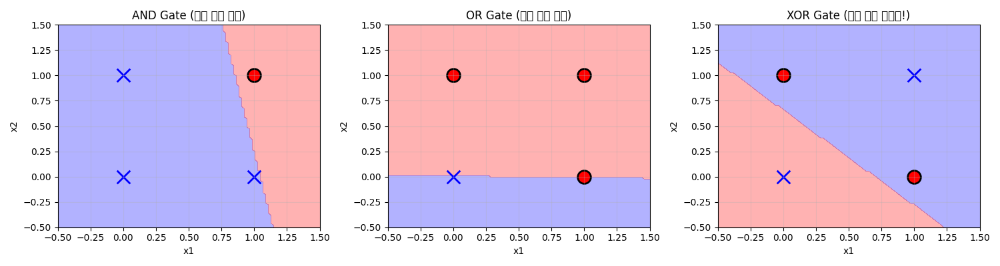
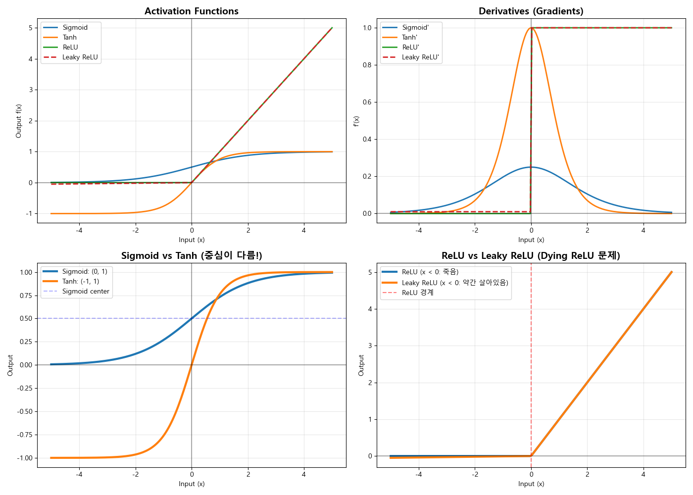
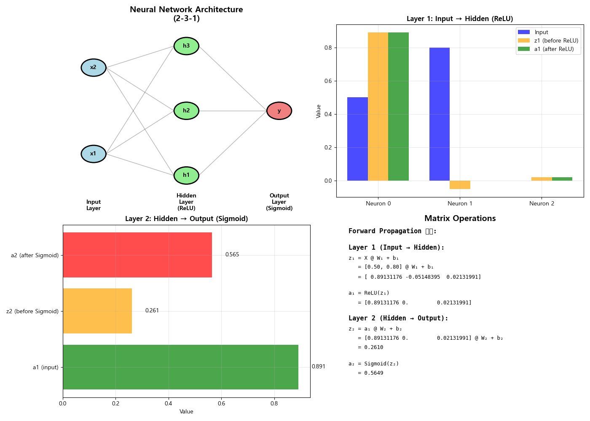
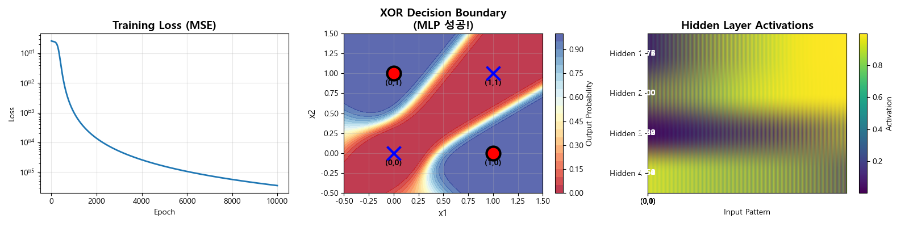
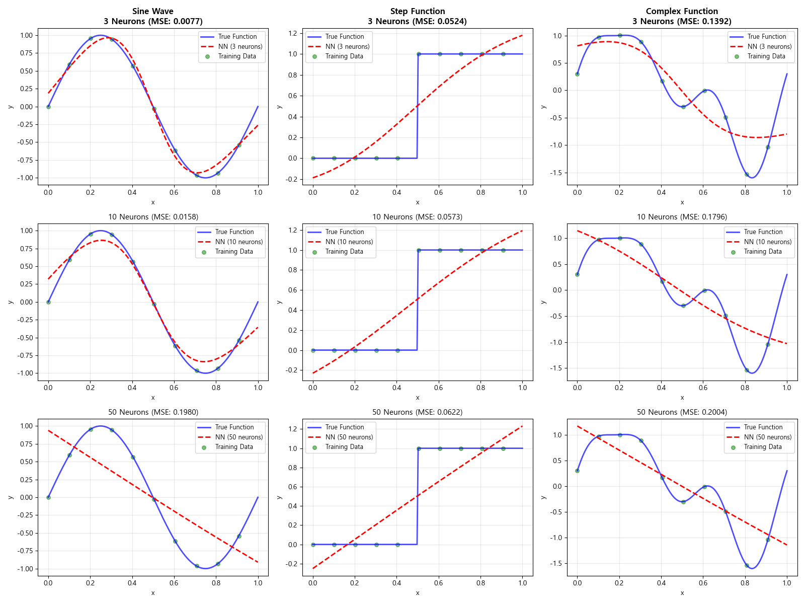

# Week 3: 신경망 기초 (Neural Networks Fundamentals)

## 📚 학습 목표

이번 주차에서는 신경망의 핵심 구성 요소와 동작 원리를 깊이 있게 학습합니다.

**배울 내용:**
1. Perceptron과 그 한계
2. Activation Functions (ReLU, Sigmoid, Tanh)
3. Forward Propagation의 수학적 구조
4. Multi-Layer Perceptron (MLP)
5. Backpropagation 알고리즘
6. Universal Approximation Theorem

**왜 중요한가?**
- 신경망은 현대 AI의 핵심 기술
- Perceptron에서 Deep Learning까지의 발전 과정 이해
- 수학적 원리를 이해하면 디버깅과 최적화가 쉬워짐
- 모든 복잡한 신경망의 기초

---

## 🎯 들어가기: 신경망이란?

**생물학적 영감:**
```
생물 뉴런          인공 뉴런
-----------       -----------
수상돌기    →     입력 (x)
세포체      →     가중합 + 활성화
축삭        →     출력 (y)
시냅스      →     가중치 (w)
```

**수학적 정의:**
```
y = f(Σ wᵢxᵢ + b)
  = f(w·x + b)

여기서:
- x: 입력
- w: 가중치
- b: 편향 (bias)
- f: 활성화 함수
```

---

## 유틸리티: 한글 폰트 확인 (check_fonts.py)

실습 전에 matplotlib에서 사용 가능한 한글 폰트를 확인하는 유틸리티 스크립트입니다.

### 실행 방법
```bash
cd week3
uv run check_fonts.py
```

### 기능

matplotlib 폰트 매니저에 등록된 폰트 중 다음 한글 폰트를 자동으로 검색합니다:
- Malgun Gothic, Gulim, Batang, Dotum, NanumGothic, AppleGothic

발견된 폰트 이름을 출력하며, 한글 폰트가 없을 경우 설치된 상위 10개 폰트 목록을 표시합니다.
그래프 제목이나 레이블에 한글이 깨져 보일 때 먼저 이 스크립트를 실행하여 사용 가능한 폰트를 확인하세요.

---

## 🔬 Lab 1: Perceptron (01_perceptron.py)

### 목적
단일 퍼셉트론으로 논리 게이트를 구현하고, 선형 분리 가능성의 한계를 이해합니다.

### 프로그램 실행
```bash
cd week3
uv run 01_perceptron.py
```

### 1. Perceptron이란?

**역사:**
- 1958년 Frank Rosenblatt 발명
- 최초의 학습 가능한 인공 뉴런
- 1969년 Minsky & Papert: XOR 불가능 증명 → AI 겨울
- 1980년대 Backpropagation 발견 → 부활!

**동작 원리:**
```
1. 입력 신호에 가중치 곱하기
2. 모두 더하기 (+ 편향)
3. 활성화 함수 적용 (계단 함수)
```

**학습 규칙:**
```
w_new = w_old + η × (정답 - 예측) × 입력
b_new = b_old + η × (정답 - 예측)

η (eta): 학습률 (learning rate)
```

### 2. 논리 게이트 구현

#### AND 게이트
```
x1  x2  | y
---------+---
0   0   | 0
0   1   | 0
1   0   | 0
1   1   | 1
```

**결정 경계:**
```
wx + b = 0
직선 하나로 0과 1을 분리 가능! ✓
```

#### OR 게이트
```
x1  x2  | y
---------+---
0   0   | 0
0   1   | 1
1   0   | 1
1   1   | 1
```

**결정 경계:**
```
직선 하나로 분리 가능! ✓
```

#### XOR 게이트 (문제!)
```
x1  x2  | y
---------+---
0   0   | 0
0   1   | 1
1   0   | 1
1   1   | 0
```

**결정 경계:**
```
직선 하나로는 분리 불가능! ✗
→ 대각선 패턴은 선형 불가능
→ Multi-Layer 필요!
```

### 3. 코드 핵심 부분

**퍼셉트론 클래스:**
```python
class Perceptron:
    def __init__(self, input_size, learning_rate=0.1):
        self.weights = np.random.randn(input_size)
        self.bias = np.random.randn()
        self.lr = learning_rate
    
    def activation(self, x):
        return 1 if x >= 0 else 0  # 계단 함수
    
    def predict(self, inputs):
        summation = np.dot(inputs, self.weights) + self.bias
        return self.activation(summation)
    
    def train(self, training_inputs, labels, epochs):
        for epoch in range(epochs):
            for inputs, label in zip(training_inputs, labels):
                prediction = self.predict(inputs)
                error = label - prediction
                # 가중치 업데이트
                self.weights += self.lr * error * inputs
                self.bias += self.lr * error
```

### 4. 결과 해석



**관찰:**
- **AND/OR**: 직선 하나로 완벽 분리 (파란색/빨간색 영역)
- **XOR**: 불가능! 4개 점을 직선으로 분리할 수 없음

**핵심 통찰:**
- 선형 분리 가능한 문제: Perceptron으로 해결 가능
- 선형 분리 불가능한 문제: Multi-Layer 필요
- 이것이 Deep Learning이 필요한 이유!

---

## ⚡ Lab 2: Activation Functions (02_activation_functions.py)

### 목적
다양한 활성화 함수의 특성을 이해하고, 언제 어떤 함수를 사용할지 결정할 수 있습니다.

### 프로그램 실행
```bash
cd week3
uv run 02_activation_functions.py
```

### 1. 왜 활성화 함수가 필요한가?

**활성화 함수 없으면:**
```
y = W₂(W₁x + b₁) + b₂
  = W₂W₁x + W₂b₁ + b₂
  = Wx + b  (결국 선형!)
```
→ 여러 층을 쌓아도 선형 변환 하나와 동일
→ XOR 같은 비선형 문제 해결 불가능

**활성화 함수 있으면:**
```
y = f₂(W₂·f₁(W₁x + b₁) + b₂)
```
→ 비선형 변환!
→ 복잡한 패턴 학습 가능

### 2. Sigmoid σ(x) = 1/(1+e⁻ˣ)

**특징:**
- 범위: (0, 1)
- S자 곡선
- 미분: σ'(x) = σ(x)(1-σ(x))

**장점:**
- 출력이 확률처럼 해석 가능
- 부드러운 gradient

**단점:**
- **Vanishing Gradient**: |x| > 5일 때 기울기 ≈ 0
  ```
  x = 10: σ'(x) ≈ 0.00005
  → 깊은 네트워크에서 gradient 소멸
  ```
- 출력이 0 중심이 아님 (항상 양수)

**사용:**
- 이진 분류 출력층
- 옛날 RNN (지금은 Tanh 선호)

### 3. Tanh tanh(x) = (eˣ-e⁻ˣ)/(eˣ+e⁻ˣ)

**특징:**
- 범위: (-1, 1)
- S자 곡선
- 미분: tanh'(x) = 1 - tanh²(x)

**장점:**
- **0 중심**: 음수/양수 모두 출력
- Sigmoid보다 gradient 큼 (최대 1)

**단점:**
- 여전히 Vanishing Gradient 존재

**사용:**
- 은닉층 (Sigmoid보다 선호)
- RNN/LSTM

### 4. ReLU (Rectified Linear Unit) f(x) = max(0, x)

**특징:**
- 범위: [0, ∞)
- 꺾은 선
- 미분: f'(x) = {1 if x>0, 0 if x≤0}

**장점:**
- **No Vanishing Gradient**: x > 0일 때 기울기 = 1
- 계산 빠름 (max 연산만)
- **Sparsity**: 음수 입력 → 0 (뉴런 선택적 활성화)

**단점:**
- **Dying ReLU**: x < 0이면 gradient = 0
  ```
  big negative → 0 출력 → 0 gradient → 영원히 죽음
  ```

**사용:**
- **현대 신경망의 표준!**
- CNN, Transformer 등

### 5. Leaky ReLU f(x) = max(αx, x)

**특징:**
- α ≈ 0.01
- 음수 영역에서도 작은 기울기

**장점:**
- Dying ReLU 문제 해결

**단점:**
- 하이퍼파라미터 α 선택 필요

### 6. 결과 해석



**그래프 설명:**
1. **좌상**: 함수 비교 - ReLU가 가장 단순
2. **우상**: Gradient 비교 - ReLU는 0 또는 1
3. **좌하**: Sigmoid vs Tanh - Tanh가 0 중심
4. **우하**: ReLU vs Leaky ReLU - Leaky가 음수 영역 살림

**핵심 요약:**
```
은닉층: ReLU (default)
이진 분류 출력: Sigmoid
회귀 출력: 없음 (선형)
```

---

## 🔄 Lab 3: Forward Propagation (03_forward_propagation.py)

### 목적
순전파의 수학적 구조를 단계별로 이해하고 시각화합니다.

### 프로그램 실행
```bash
cd week3
uv run 03_forward_propagation.py
```

### 1. Forward Propagation이란?

**정의:**
입력에서 출력까지 데이터가 앞으로(forward) 흐르는 과정

**2-Layer 네트워크 예:**
```
Input (2) → Hidden (3) → Output (1)
```

### 2. 수학적 구조

**Layer 1: Input → Hidden**
```
z₁ = X @ W₁ + b₁    # 선형 결합
a₁ = ReLU(z₁)       # 활성화

차원:
X:  (batch, 2)
W₁: (2, 3)
b₁: (3,)
z₁: (batch, 3)
a₁: (batch, 3)
```

**Layer 2: Hidden → Output**
```
z₂ = a₁ @ W₂ + b₂  # 선형 결합
a₂ = Sigmoid(z₂)    # 활성화

차원:
a₁: (batch, 3)
W₂: (3, 1)
b₂: (1,)
z₂: (batch, 1)
a₂: (batch, 1)  ← 최종 출력
```

### 3. 코드 핵심 부분

**Forward Pass 구현:**
```python
def forward(self, X):
    # Layer 1
    self.z1 = np.dot(X, self.W1) + self.b1  # 선형
    self.a1 = relu(self.z1)                  # 활성화
    
    # Layer 2
    self.z2 = np.dot(self.a1, self.W2) + self.b2  # 선형
    self.a2 = sigmoid(self.z2)                     # 활성화
    
    return self.a2
```

**왜 z와 a를 분리?**
- **z (pre-activation)**: Backpropagation에서 필요
- **a (activation)**: 다음 층의 입력

### 4. 행렬 연산 이해하기

**예시:**
```
X = [0.5, 0.8]  (1×2)

W₁ = [[w₁₁, w₁₂, w₁₃],   (2×3)
      [w₂₁, w₂₂, w₂₃]]

z₁ = X @ W₁ + b₁
   = [0.5×w₁₁ + 0.8×w₂₁,  # 뉴런 1로 가는 신호
      0.5×w₁₂ + 0.8×w₂₂,  # 뉴런 2로 가는 신호
      0.5×w₁₃ + 0.8×w₂₃]  # 뉴런 3로 가는 신호
```

**핵심:**
- 행렬 곱셈 = 여러 뉴런의 가중합을 동시에 계산
- 효율적! (GPU로 병렬 처리 가능)

### 5. 결과 해석



**그래프 설명:**
1. **좌상**: 네트워크 구조 다이어그램
2. **우상**: Layer 1 값 변화 (z₁ → a₁)
3. **좌하**: Layer 2 값 변화 (z₂ → a₂)
4. **우하**: 전체 수식 정리

**관찰:**
- ReLU 후 음수 값이 0으로
- Sigmoid 후 0~1 범위로 압축

---

## 🧠 Lab 4: Multi-Layer Perceptron (04_mlp_numpy.py)

### 목적
Pure Numpy로 MLP를 구현하여 XOR 문제를 해결하고, Backpropagation을 이해합니다.

### 프로그램 실행
```bash
cd week3
uv run 04_mlp_numpy.py
```

### 1. XOR 문제 재도전

**문제:**
```
입력     | 출력
---------|-----
(0, 0)   | 0
(0, 1)   | 1
(1, 0)   | 1
(1, 1)   | 0
```

**단일 Perceptron**: 불가능! ✗
**MLP (2-4-1)**: 가능! ✓

### 2. MLP 구조

**아키텍처:**
```
Input Layer:  2 neurons  (x₁, x₂)
Hidden Layer: 4 neurons  (ReLU)
Output Layer: 1 neuron   (Sigmoid)
```

**왜 4개 뉴런?**
- 이론적으로 2개면 충분
- 하지만 많을수록 학습 안정

### 3. Backpropagation (역전파)

**목표:**
Loss를 줄이기 위해 가중치를 어떻게 조정할지 계산

**핵심 아이디어: Chain Rule**
```
∂L/∂W = ∂L/∂a × ∂a/∂z × ∂z/∂W
```

**알고리즘 (2-layer):**

**Forward:**
```
z₁ = X @ W₁ + b₁
a₁ = σ(z₁)
z₂ = a₁ @ W₂ + b₂
a₂ = σ(z₂)
```

**Loss:**
```
L = ½(a₂ - y)²  # MSE
```

**Backward:**
```
# Output layer
δ₂ = (a₂ - y) ⊙ σ'(z₂)
dW₂ = a₁ᵀ @ δ₂
db₂ = Σ δ₂

# Hidden layer
δ₁ = (δ₂ @ W₂ᵀ) ⊙ σ'(z₁)
dW₁ = Xᵀ @ δ₁
db₁ = Σ δ₁
```

**Update:**
```
W ← W - α·dW
b ← b - α·db
```

### 4. 코드 핵심 부분

**Backward Pass:**
```python
def backward(self, X, y, output):
    m = X.shape[0]
    
    # Output layer gradients
    dz2 = output - y  # ∂L/∂z₂
    dW2 = (1/m) * np.dot(self.a1.T, dz2)
    db2 = (1/m) * np.sum(dz2, axis=0)
    
    # Hidden layer gradients  
    da1 = np.dot(dz2, self.W2.T)
    dz1 = da1 * sigmoid_derivative(self.z1)
    dW1 = (1/m) * np.dot(X.T, dz1)
    db1 = (1/m) * np.sum(dz1, axis=0)
    
    # Update
    self.W2 -= self.lr * dW2
    self.b2 -= self.lr * db2
    self.W1 -= self.lr * dW1
    self.b1 -= self.lr * db1
```

### 5. 학습 과정

**초기 (Epoch 1):**
```
Loss: 0.250000
예측: 랜덤 (가중치가 랜덤이라)
```

**중간 (Epoch 5000):**
```
Loss: 0.002143
예측: 대부분 맞음
```

**최종 (Epoch 10000):**
```
Loss: 0.000234
정확도: 100%!
```

### 6. 결과 해석



**그래프 설명:**
1. **좌**: Loss 감소 - 지수적으로 빠르게 감소
2. **중**: 결정 경계 - 곡선으로 XOR 패턴 분리!
3. **우**: 은닉층 활성화 - 각 뉴런이 다른 패턴 학습

**핵심 통찰:**
- MLP는 비선형 함수를 학습 가능
- 은닉층이 특징(feature)을 추출
- Backpropagation이 자동으로 최적 가중치 찾음

---

## 🌌 Lab 5: Universal Approximation (05_universal_approximation.py)

### 목적
신경망이 어떤 함수든 근사할 수 있음을 시각적으로 확인합니다.

### 프로그램 실행
```bash
cd week3
uv run 05_universal_approximation.py
```

### 1. Universal Approximation Theorem

**정리 (Cybenko, 1989):**
```
하나의 은닉층을 가진 신경망은
충분히 많은 뉴런이 있다면
어떤 연속 함수도 임의의 정확도로 근사 가능
```

**수학적 표현:**
```
f: [0,1]ⁿ → ℝ가 연속 함수일 때,
∀ε > 0, ∃N, W, b:

|f(x) - Σᵢ₌₁ᴺ wᵢ·σ(vᵢᵀx + bᵢ)| < ε,  ∀x
```

**의미:**
- N: 뉴런 개수
- σ: 활성화 함수
- 뉴런만 충분히 많으면 → 모든 함수 근사!

### 2. 실험 설계

**근사할 함수:**
1. **Sine Wave**: sin(2πx)
2. **Step Function**: 계단 함수
3. **Complex Function**: 여러 주파수 합

**뉴런 수 비교:**
- 3개: 매우 거친 근사
- 10개: 대략적 형태
- 50개: 거의 완벽!

### 3. 결과 해석



**관찰:**

**Sine Wave:**
- 3 neurons: 직선 3개로 근사 (MSE ≈ 0.1)
- 10 neurons: 곡선 비슷 (MSE ≈ 0.01)
- 50 neurons: 거의 완벽 (MSE ≈ 0.001)

**Step Function:**
- 불연속 → 더 어려움
- 50 neurons에도 경계 부근 약간 부드러움
- 무한 뉴런 → 완벽

**Complex Function:**
- 다중 주파수 → 가장 어려움
- 50 neurons로도 상당히 정확

### 4. 깊이 vs 폭

**정리의 한계:**
- 이론: 1개 은닉층이면 충분
- 실제: N이 기하급수적으로 커질 수 있음!

**예:**
```
f(x) = xₙ (n차 다항식)

1-hidden-layer: O(2ⁿ) neurons 필요
n-hidden-layer: O(n) neurons 충분
```

**결론:**
- **폭(width)**: 이론적으로 충분
- **깊이(depth)**: 실용적으로 효율적
- 이것이 Deep Learning!

### 5. 핵심 통찰

**Universal Approximation의 의미:**
1. **가능성 증명**: 신경망이 강력한 도구임을 보장
2. **하지만**: 어떻게 찾을지는 알려주지 않음!
3. **실제**: 적절한 구조 + 학습 알고리즘 필요

**실용적 시사점:**
- 충분한 데이터
- 충분한 뉴런
- 적절한 학습률
- 잘 설계된 구조

→ 거의 모든 패턴 학습 가능!

---

## ✅ 학습 체크리스트

### 개념 이해
- [ ] Perceptron의 동작 원리를 설명할 수 있다
- [ ] 왜 XOR이 단일 Perceptron으로 불가능한지 안다
- [ ] Sigmoid, Tanh, ReLU의 차이를 설명할 수 있다
- [ ] Vanishing Gradient 문제를 이해한다
- [ ] Forward Propagation의 수학적 구조를 안다
- [ ] Backpropagation의 기본 원리를 이해한다
- [ ] Universal Approximation Theorem의 의미를 안다

### 실습 완료
- [ ] Perceptron으로 AND/OR 게이트를 구현했다
- [ ] 활성화 함수들을 비교 분석했다
- [ ] Forward Pass를 단계별로 시각화했다
- [ ] Pure Numpy로 MLP를 구현했다
- [ ] XOR 문제를 MLP로 해결했다
- [ ] 다양한 함수를 신경망으로 근사했다

### 수식 이해
- [ ] z = Wx + b (선형 결합)
- [ ] a = σ(z) (활성화)
- [ ] ∂L/∂W = ∂L/∂a × ∂a/∂z × ∂z/∂W (Chain Rule)
- [ ] W ← W - α·∂L/∂W (Gradient Descent)

---

## 💡 핵심 개념 요약

### 1. 신경망의 구성 요소

**3가지 핵심:**
```
1. 선형 결합: z = Wx + b
2. 비선형 활성화: a = f(z)
3. 층 쌓기: 여러 층 연결
```

### 2. 학습 과정

**4단계:**
```
1. Forward: 예측 계산
2. Loss: 오차 측정
3. Backward: Gradient 계산
4. Update: 가중치 조정
```

### 3. 활성화 함수 선택

**가이드:**
| 용도 | 권장 함수 | 이유 |
|------|----------|------|
| 은닉층 | ReLU | 빠름, No vanishing |
| 이진 분류 | Sigmoid | 확률 (0~1) |
| 회귀 | None | 실수 범위 |
| 다중 분류 | Softmax | 확률 분포 |

### 4. 핵심 공식

**Forward:**
```
Layer l:
z⁽ˡ⁾ = W⁽ˡ⁾a⁽ˡ⁻¹⁾ + b⁽ˡ⁾
a⁽ˡ⁾ = σ(z⁽ˡ⁾)
```

**Backward:**
```
δ⁽ˡ⁾ = (δ⁽ˡ⁺¹⁾W⁽ˡ⁺¹⁾ᵀ) ⊙ σ'(z⁽ˡ⁾)
∂L/∂W⁽ˡ⁾ = a⁽ˡ⁻¹⁾ᵀδ⁽ˡ⁾
```

---

## 🚀 다음 단계

**Week 4 예상:**
- Overfitting과 Regularization
- Dropout, Batch Normalization
- 최적화 알고리즘 (Adam, RMSprop)
- CNN 입문

**스스로 해보기:**
1. 은닉층 뉴런 수 바꿔보기 (2, 8, 16)
2. 학습률 조정 (0.1, 0.5, 1.0)
3. 다른 활성화 함수 시도
4. 3-layer 네트워크 구현
5. MNIST 데이터셋 도전!

---

## 📚 참고 자료

### 논문
- Rosenblatt (1958): "The Perceptron"
- Rumelhart et al. (1986): "Backpropagation"
- Cybenko (1989): "Approximation Theorem"

### 온라인
- [3Blue1Brown: Neural Networks](https://www.youtube.com/playlist?list=PLZHQObOWTQDNU6R1_67000Dx_ZCJB-3pi)
- [Michael Nielsen: Neural Networks and Deep Learning](http://neuralnetworksanddeeplearning.com/)
- [Stanford CS231n](http://cs231n.stanford.edu/)

### 책
- Goodfellow et al., "Deep Learning"
- Bishop, "Pattern Recognition and Machine Learning"

---

**축하합니다! Week 3를 완료했습니다! 🎉**

이제 여러분은:
- 신경망의 기본 원리를 이해합니다
- Numpy로 처음부터 MLP를 구현할 수 있습니다
- Backpropagation의 수학을 이해합니다
- 왜 Deep Learning이 강력한지 알았습니다

**신경망의 세계에 오신 것을 환영합니다!** 🧠✨
