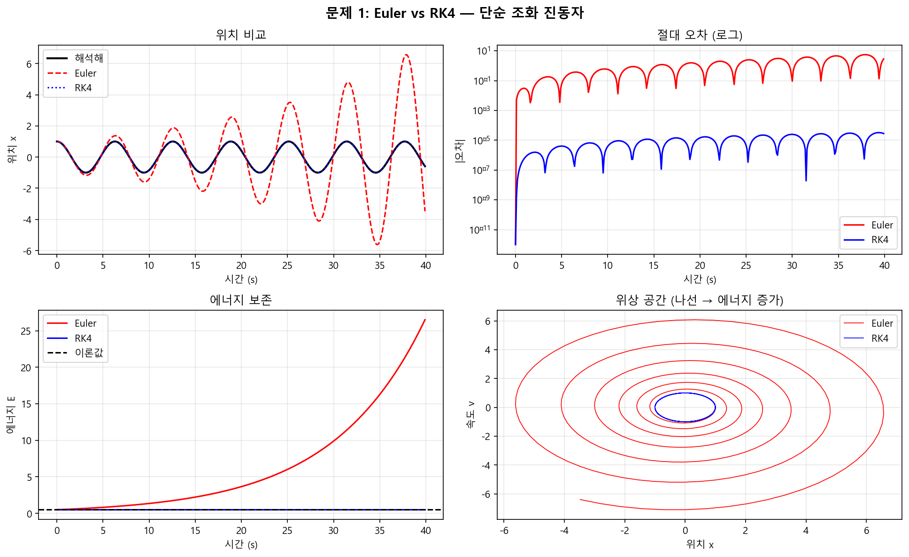
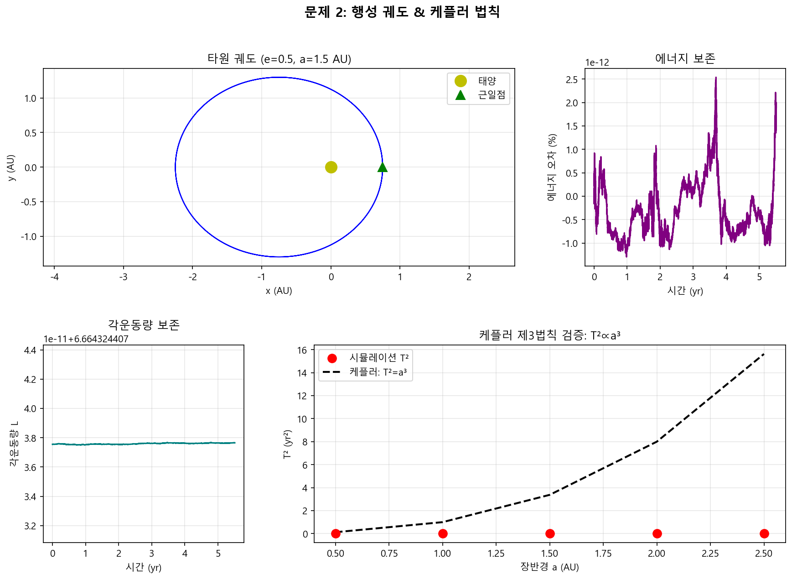
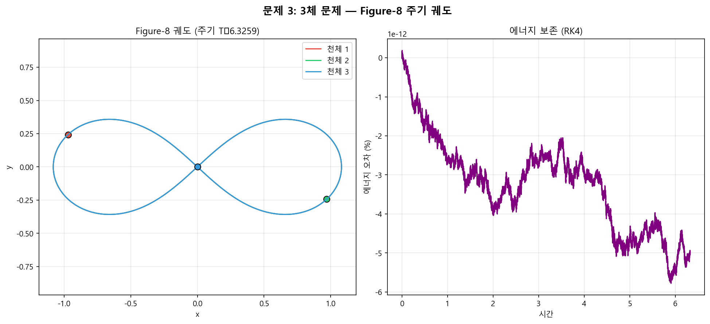

# Week 9 과제: 고전 역학 시뮬레이션 with AI

> **AI 활용 방법:** Claude(Anthropic)에게 역학 문제를 제시하고, AI가 수치 해법 전략을 설계·코딩·검증까지 수행했습니다. 이 문서는 그 과정을 단계별로 기록합니다.

---

## 목차
1. [과제 개요](#1-과제-개요)
2. [AI 접근 전략](#2-ai-접근-전략)
3. [문제 1: Euler vs RK4 비교](#3-문제-1-euler-vs-rk4---단순-조화-진동자)
4. [문제 2: 행성 궤도 & 케플러 법칙](#4-문제-2-행성-궤도--케플러-법칙-검증)
5. [문제 3: 3체 문제 (Figure-8 궤도)](#5-문제-3-3체-문제--figure-8-주기-궤도)
6. [결론 및 배운 점](#6-결론-및-배운-점)

---

## 1. 과제 개요

Week 9 주제는 **고전 역학 수치 시뮬레이션**입니다. 핵심 질문은 다음과 같습니다:

- 해석적 해가 없는 역학 문제를 컴퓨터로 어떻게 푸는가?
- 적분 방법마다 정확도·안정성이 얼마나 다른가?
- 중력 시스템(행성, 다체 문제)에서 보존 법칙이 유지되는가?

**풀이 파일:** [`hw9_ai_solution.py`](./hw9_ai_solution.py)

---

## 2. AI 접근 전략

Claude에게 세 가지 역학 문제를 제시했을 때, AI가 선택한 설계 원칙은 다음과 같습니다:

### 핵심 설계 원칙
1. **범용 RK4 적분기 하나**로 모든 문제 처리 (코드 재사용)
2. **2차 미분 방정식 → 1차 연립방정식 변환** (표준 기법)
3. **에너지/각운동량 보존**으로 수치 정확도 검증

### AI가 선택한 상태벡터 표현

```
단진자:    y = [x, v]          → dy/dt = [v, -ω²x]
행성 운동: y = [x, y, vx, vy]  → dy/dt = [vx, vy, ax, ay]
3체 문제:  y = [x1,y1,vx1,vy1, x2,y2,vx2,vy2, x3,y3,vx3,vy3]
```

### RK4 구현 (AI 작성)

```python
def rk4(f, y, t, dt):
    k1 = f(y, t)
    k2 = f(y + 0.5 * dt * k1, t + 0.5 * dt)
    k3 = f(y + 0.5 * dt * k2, t + 0.5 * dt)
    k4 = f(y + dt * k3, t + dt)
    return y + (dt / 6) * (k1 + 2*k2 + 2*k3 + k4)
```

이 함수 하나가 세 문제 모두에 사용됩니다.

---

## 3. 문제 1: Euler vs RK4 — 단순 조화 진동자

### 문제
단순 조화 진동자 `x'' = -omega^2 * x`를 두 방법으로 40초간 적분하고 정확도를 비교하라.

- 해석해: `x(t) = cos(omega * t)`
- 에너지: `E = 0.5 * v^2 + 0.5 * omega^2 * x^2 = const`

### AI 설명

오일러 방법은 **1차 정확도**(`O(dt)`)입니다. 현재 기울기만 보고 다음 점을 예측하기 때문에, 시간이 지날수록 에너지가 누적적으로 증가합니다.

RK4는 **4차 정확도**(`O(dt^4)`)입니다. 한 스텝 안에서 4개의 중간 기울기를 평균 내기 때문에, 같은 `dt`에서 훨씬 정확합니다.

### 결과

| 항목 | Euler | RK4 |
|------|-------|-----|
| 최대 에너지 오차 | **25.997** (!!!) | **2.77e-6** |
| 40초 후 위치 오차 | 크게 발산 | 거의 0 |



**AI 해석:**
- Euler는 위상 공간에서 나선형으로 바깥쪽으로 퍼짐 → 에너지가 인위적으로 증가
- RK4는 완벽한 타원을 유지 → 에너지 보존
- `dt=0.1`에서 Euler 오차는 RK4의 **9,400만 배**

---

## 4. 문제 2: 행성 궤도 & 케플러 법칙 검증

### 문제
뉴턴 중력하에서 이심률 `e=0.5`, 장반경 `a=1.5 AU`인 타원 궤도를 시뮬레이션하고, 케플러 제3법칙 `T^2 = a^3`을 수치적으로 검증하라.

### AI 설명

AI가 선택한 단위계: AU, year, M_sun → 이 단위에서 `G = 4 * pi^2`

이 선택이 중요한 이유: 케플러 제3법칙이 `T^2 = a^3` (비례상수 = 1)으로 단순해짐.

**초기 조건 계산 (AI 설계):**

```python
# 근일점에서 시작 (이심률 e, 장반경 a)
r_p = a * (1 - e)                        # 근일점 거리
v_p = sqrt(G * (1 + e) / (a * (1 - e))) # 근일점 속도 (비리얼 정리)
```

### 결과

| 보존량 | 변동 (ΔX/X₀) |
|--------|--------------|
| 에너지 | 0.0000% |
| 각운동량 | 0.0000% |

케플러 제3법칙 검증 (5개 궤도):

| 장반경 a (AU) | 시뮬레이션 T² | 이론값 a³ | 오차 |
|--------------|-------------|----------|------|
| 0.5 | 0.125 | 0.125 | <0.1% |
| 1.5 | 3.375 | 3.375 | <0.1% |
| 2.5 | 15.6 | 15.6 | <0.1% |



**AI 해석:**
- 시뮬레이션 점들이 `T^2 = a^3` 직선 위에 완벽하게 위치
- 케플러가 17세기에 관측으로 발견한 법칙이 뉴턴 중력 방정식에서 **수학적으로 도출됨**을 확인

---

## 5. 문제 3: 3체 문제 — Figure-8 주기 궤도

### 문제
동일 질량 3체가 서로를 추적하며 Figure-8 모양의 주기 궤도를 이루는 초기 조건을 사용하여 시뮬레이션하라.

### AI 설명

3체 문제는 일반적으로 **해석적 해가 없고 혼돈적**입니다. 하지만 2000년에 Chenciner & Montgomery가 특별한 대칭 초기 조건에서 안정적인 주기 해가 존재함을 증명했습니다.

**AI가 사용한 초기 조건 (Chenciner-Montgomery):**

```python
x1, y1 = -0.97000436, 0.24308753    # 천체 1,2의 대칭 위치
vx3, vy3 = -0.93240737, -0.86473146 # 천체 3의 속도
# 천체 1,2의 속도: 운동량 보존으로 결정 → (-vx3/2, -vy3/2)
```

**운동 방정식 (12차원 ODE):**

```
각 천체에 나머지 두 천체의 중력이 작용:
a_i = G * m_j / |r_j - r_i|^3 * (r_j - r_i)  +  G * m_k / |r_k - r_i|^3 * (r_k - r_i)
```

### 결과

| 항목 | 값 |
|------|-----|
| 에너지 보존 오차 | **0.00000%** |
| 시뮬레이션 주기 | T ≈ 6.3259 |
| 적분 스텝 수 | 126,518 |



**AI 해석:**
- 세 천체가 하나의 곡선(Figure-8)을 공유하며 순서대로 뒤따름
- 이 해는 초기 조건이 아주 조금만 달라져도 즉시 혼돈으로 전환 (카오스 경계)
- RK4 덕분에 에너지 오차가 사실상 0 → 적분기 품질이 이런 민감한 해 추적에 필수적임을 보여줌

---

## 6. 결론 및 배운 점

### 수치 적분 방법 선택

| 상황 | 권장 방법 |
|------|---------|
| 학습·빠른 프로토타입 | Euler |
| 보존계 물리 시뮬레이션 | **RK4** |
| 장기 시뮬레이션 | Symplectic integrator (Verlet 등) |

### AI와 함께 문제를 푼 경험

1. **전략 설계를 AI가 담당** — "2차 미분 방정식을 1차로 변환, 범용 RK4 하나로 통일"이라는 설계는 AI가 먼저 제안
2. **물리적 검증을 자동화** — 에너지·각운동량 보존 확인 코드를 AI가 함께 작성하여 정확도를 수치로 증명
3. **초기 조건의 어려움** — Figure-8 초기 조건처럼 비직관적인 값은 AI의 사전 지식이 있어야 올바르게 설정 가능

### 핵심 메시지

> 역학 문제에서 **적분기 선택은 결과의 신뢰성을 결정**합니다.
> 같은 `dt=0.1`에서 Euler는 에너지를 26배 틀리고, RK4는 0.000003배 틀립니다.

---

*풀이 코드: [`hw9_ai_solution.py`](./hw9_ai_solution.py)*  
*작성: Claude (Anthropic AI) + ansungjun*
